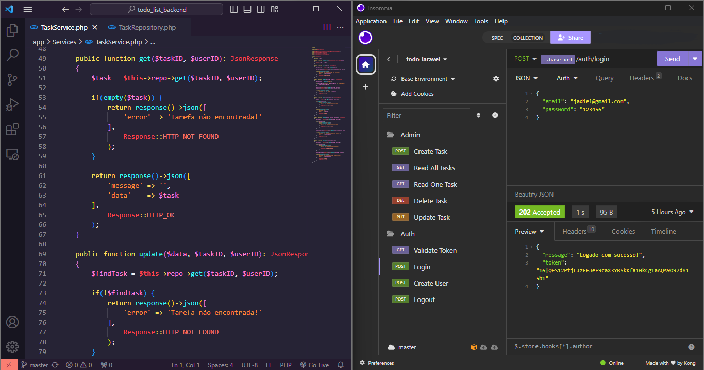

# Todo List Backend


This project is an API with **Sanctum** authentication built using **PHP**, **Laravel** and **MySQL**. I'm using the **repositories** pattern and the **service** layer, that is very important thinking in `maintainability` and `scalability`.



# Content Table
* <a href="#installations">Installations</a>
* <a href="#settings">Settings</a>
* <a href="#endpoints">Endpoints</a>
* <a href="#run-project">Run</a>

# Install Project

```bash
git clone https://github.com/jadielsanttos/todo_list_backend
```

```bash
cd todo_list_backend
```

# Settings

1 - Run command composer install to generate composer.json

```bash
composer install
```

2 - With your database already created, add and change .env file to connect with your database

```bash
cp .env.example .env
```

3 - Create application key

```bash
php artisan key:generate
```

4 - Run migrations

```bash
php artisan migrate
```

# Endpoints

## Users Routes

* ### POST /auth/login:
    * To login at the system, access `/auth/login`, the fields **email** and **password** are required.

    * A token of authentication will be generated.

* ### POST /auth/register:
    * To create an account, access `/auth/register`, the fields **email** and **password** are required too.

    * A token of authentication will be generated.

* ### POST /auth/logout:
    * To logout, access `/auth/logout`, the **token** must be sent.

* ### GET /auth/validate:
    * To validate token, access `/auth/validate`, the **token** must be sent.

## Tasks Routes

* ### GET /tasks:
    * To get all tasks of logged user, access `/tasks`, the **token** must be sent.

* ### GET /task/{id}:
    * To get single task, access `/task/{id}`, the id of task must be sent. The **token** must be sent too.

* ### POST /task/new:
    * To create a new task, access `/task/new`, the fields **title**, **description** and **author** are required. The **token** must be sent.

* ### PUT /task/update/{id}:
    * To update a task, access `/task/update/{id}`, the id of task must be sent. The **token** must be sent too.

* ### DELETE /task/delete/{id}:
    * To delete a task, access `/task/delete/{id}`, the id of task must be sent. The **token** must be sent too.

# Run Project

Finally, to run the application, just do it bellow

1 - Run the command

```bash
php artisan serve
```

2 - Access [http://localhost:8000](http://localhost:8000) and just be happy
